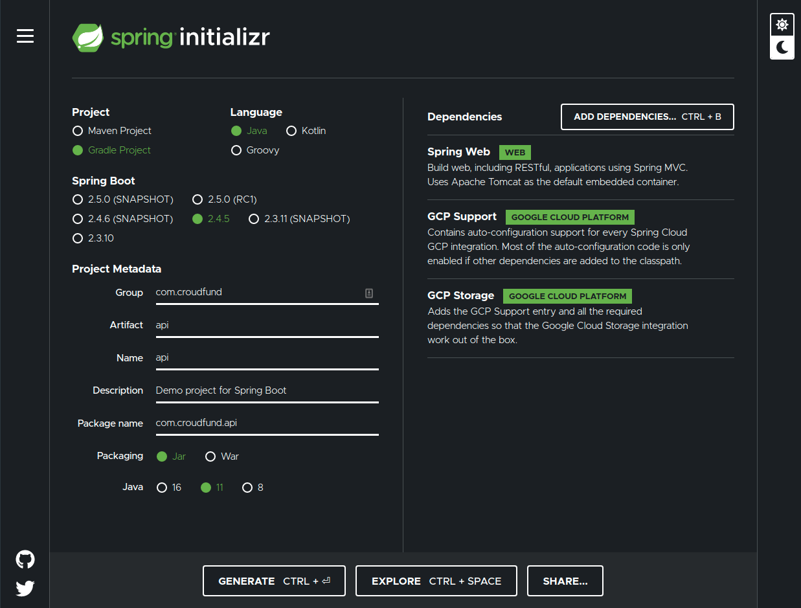

# crowdfund api

## docker notes

```bash
# build docker
docker build -t springio/gs-spring-boot-docker .

# run the app
docker run -p 8080:8080 springio/gs-spring-boot-docker

```

```bash
# build using gradle
./gradlew build

gcloud auth login
export PROJECT_ID=general-sand-box
gcloud config set project $PROJECT_ID
# install kubernetes components
sudo apt-get install kubectl

# build the image for gcloud
docker build -t gcr.io/${PROJECT_ID}/hello-app:v1 .

# run the image
docker run --rm -p 8080:8080 gcr.io/${PROJECT_ID}/hello-app:v1

# add image to container registry

# enable
gcloud services enable containerregistry.googleapis.com
# configure docker
gcloud auth configure-docker
# push image
docker push gcr.io/${PROJECT_ID}/hello-app:v1

# set autopilot cluster
# list all
gcloud compute regions list
# europe-west3-a Frankfurt, Germany Europe
export COMPUTE_ZONE=europe-west3
gcloud config set compute/region $COMPUTE_ZONE

# create a cluster
gcloud container clusters create-auto hello-cluster

# ensure you are connect to GKE cluster 
gcloud container clusters get-credentials hello-cluster --zone $COMPUTE_ZONE

# create the deployment
kubectl create deployment hello-app --image=gcr.io/${PROJECT_ID}/hello-app:v1

# check if is running
kubectl get service

# expose the cluster
kubectl expose deployment hello-app --name=hello-app-service --type=LoadBalancer --port 80 --target-port 8080
# ip: 34.107.21.51

# build new version
docker build -t gcr.io/${PROJECT_ID}/hello-app:v2 .
docker push gcr.io/${PROJECT_ID}/hello-app:v2


# update the hello-app
kubectl set image deployment/hello-app hello-app=gcr.io/${PROJECT_ID}/hello-app:v2
# watch update happening
watch kubectl get pods

# cleaning up
kubectl delete service hello-app-service
gcloud container clusters delete hello-cluster --zone $COMPUTE_ZONE
gcloud container images delete gcr.io/${PROJECT_ID}/hello-app:v1  --force-delete-tags --quiet
gcloud container images delete gcr.io/${PROJECT_ID}/hello-app:v2  --force-delete-tags --quiet
```

## spring boot

Initialize spring application


[Dockerizeerize a spring boot application](https://www.baeldung.com/dockerizing-spring-boot-application)
[Getting started spring boot and docker](https://spring.io/guides/gs/spring-boot-docker/)

## gcloud notes

[deploy containerized web appliatins](https://cloud.google.com/kubernetes-engine/docs/tutorials/hello-app)
[kubernetes secrets](https://cloud.google.com/kubernetes-engine/docs/concepts/secret#kubectl)

## google cloud run

[cloud run code lab](https://codelabs.developers.google.com/codelabs/cloud-run-deploy#0)

```bash
gcloud compute zones list
gcloud config set compute/zone europe-west3-a
gcloud config set run/region europe-west3
gcloud services enable cloudbuild.googleapis.com

export PROJECT_ID=general-sand-box
. scripts/set-env.bash
# build the binaries
./gradlew build

# gcloud builds submit --tag gcr.io/${PROJECT_ID}/crowdfunding:1.0.0 .
# gcloud auth configure-docker
docker build -t gcr.io/${PROJECT_ID}/crowdfunding:v1 .

docker push gcr.io/${PROJECT_ID}/crowdfunding:v1
export SERVICE=crowdfunding
gcloud run deploy $SERVICE --image gcr.io/${PROJECT_ID}/crowdfunding:v1
gcloud run deploy $SERVICE --platform=managed --region=europe-west3  --image gcr.io/${PROJECT_ID}/crowdfunding:v1
Service URL: https://crowdfunding-p5nkcibfnq-ey.a.run.app
## option
# 1 (fully managed)
# 14 (region)

```

## build and use provided secrets

```bash
export PROJECT_ID=general-sand-box
export SERVICE=crowdfunding
. scripts/set-env.bash
./gradlew build -x test
docker build -t gcr.io/${PROJECT_ID}/crowdfunding:v1 .
docker run -p 8080:8080 gcr.io/${PROJECT_ID}/crowdfunding:v1
docker run -it gcr.io/${PROJECT_ID}/crowdfunding:v1 /bin/bash
docker push gcr.io/${PROJECT_ID}/crowdfunding:v1
gcloud alpha run deploy $SERVICE --platform=managed --region=europe-west3  --image gcr.io/${PROJECT_ID}/crowdfunding:v1 --update-secrets=TEST_ENV=my-secret:1

```

### describe the service
```bash
gcloud run services describe $SERVICE --platform=managed --region=europe-west3

```

## run erdpy from java
```bash
# fast run
export PROJECT_ID=general-sand-box
. scripts/set-env.bash
./gradlew build
docker build -t gcr.io/${PROJECT_ID}/crowdfunding:v1 .
docker run -it gcr.io/${PROJECT_ID}/crowdfunding:v1 /bin/bash
docker run -p 8080:8080 gcr.io/${PROJECT_ID}/crowdfunding:v1
```

## set env end run from intellij build stuff
```bash
./scripts/set-contract.bash

erdpy contract new mycontract --template crowdfunding-egld
erdpy contract build
erdpy contract test
```